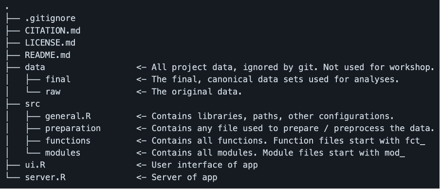

```{r setup, include=FALSE}
knitr::opts_chunk$set(echo = TRUE, eval = FALSE)
```

## Introduction

In this workshop, you will learn the basics of how to build a shiny app. As sample data, we will use “ChickWeight”, which is already in-built in R. 

This workshop uses different branches on the github project CIDskills_shinybasics available at [this repository](https://github.com/valeriabonapersona/CID_shinybasics)

In R studio:

- create a new project 
- use Version Control
- Git
- under “Repository URL” copy the link https://github.com/valeriabonapersona/CID_shinybasics 

In this way, you will create a project on your computer that contains the whole workshop.

## Part A: Gather ideas

The first step of building a shiny app is to understand what you would like to develop. *Who is supposed to use it? What is it supposed to do? How do you want your app to look like?*

For our example, we want to build an app to share research data with other researchers. The users can select data, and the app outputs a plot and summary statistics. The app is therefore composed of three parts: 

1) somewhere to select data, 
2) a plot, 
3) summary statistics. 


There are several types of layout (see [here](https://shiny.rstudio.com/articles/layout-guide.html)). My suggestion is to draw on a piece of paper (yes, paper and pencil!) how you would like the app to look like. 


## Part B: preparation

To generate our outputs, we need:

1) data in the correct format, 
2) a function to plot, and 
3) a function to create summary statistics. 

I recommend preparing these elements (and have them *properly working*) before adding them to the app. It will avoid frustration along the way (experience talking...). 

To jump directly into the app building, I have prepared these elements in advance. They have already been placed in the app according to a specific structure (see Fig 2 below). I use this structure for all my apps. You do not have to use this structure, but I would suggest to be consistent, coherent and to report it well in your README file. 

In the tutorial's READme file: 



Therefore, all data would go in `data/final/`; all functions will go to `src/functions/`. Curious about “modules”? We will see later in the tutorial what those are.

In the main directory, the file `run_prep.R` calls on all other files. In other words, you need to run only the file `run_prep.R` to have **all** the preparatory files ready. 

Go to the branch “preparation” to see how the project looks at this stage. 

Have a look at the `ui.R`, `server.R`,`run_prep.R` files. This is a basic structure of how each file should look like in any project. Open `ui.R` or `server.R` and press the button `“Run App”`. This is your empty app, *your canvas*. 


## Part C: layout

A shiny app is composed by two main files: 

1) ui.R and 
2) server.R 

The ui file contains all the information about the user interface, while the server file contains all the information about the operations to do. In other words, the server does all the work, and the ui organizes it and makes it easy to use (and pleasant to watch). 

Let’s create the basic structure of our ui. You can imagine the structure of the app in boxes. Big boxes contain smaller boxes. The white page you created in **Part B** is the biggest box. In the code, this white page is represented by `fluidPage()`, which will contain within its brackets all the other boxes. If a box extends horizontally through all the available space, then the box is self-standing. For example, for us the Title is a self-standing box because it occupies the whole horizontal part of the page. 

Following our paper&pencil drawing of **Part A**, our basic structure has: 

1)	a title	`titlePanel()`
2)	a panel on the side for filtering data `sidebarPanel()`
3)	a main panel for the outputs `mainPanel()`

The `sidebarPanel()` and the `mainPanel()` are next to each other. Therefore, they are not self-standing boxes, but they belong to a bigger box called `sidebarLayout()`. In other words, `sidebarLayout()` occupies fully the horizontal space and it contains `sidebarPanel()` and `mainPanel()`.

Furthermore, the `mainPanel()` contains two boxes: one for the plot and one for the summary statistics. These will be placed in two separate tabs within `mainPanel()`.

The structure of the ui is therefore: 

* `titlePanel()`		**of note: when adding code to R, type titlePanel(‘my title’)
* `sidebarLayout()`
    * `sidebarPanel()`
    * `mainPanel()`
        * `tabsetPanel()`
            * `tabPanel(‘plot’)`
            * `tabPanel(‘stats’)`

As a general rule, the bigger nest contains the smaller nests. For example, `sidebarLayout()` contains `sidebarPanel()` and `mainPanel()`. Conversely, elements at the same nest level are separated by a comma. For example, `sidebarPanel()` COMMA `mainPanel()` . 

Try now to create the ui with the information provided. The answer is in the `git branch *layout*`. 

The app should look like this: 


## Part D: filtering
Next, interactive filtering of the data. This has two components: 

* one in the ui, and 
* the other in the server. 


### ui
Shiny provides functions to generate ui. Here, we will use `selectizeInput()` and `sliderInput()`. We will use `selectizeInput()` for variables with factors. We will use `sliderInput()` for continuous numerical variables. For more types of input, see [this cheatsheet](https://shiny.rstudio.com/images/shiny-cheatsheet.pdf).  
 
We will write wrapper functions to these and place them in `src/functions/fct_filtering.R`. A *wrapper function* is a function around a shiny function where certain variables have already been set according to our needs. In this way, we will be sure that every time we use a certain shiny function in our own app, it will look the same (i.e. we will make the same choices). This may now seem redundant, but once the app becomes more complex, it is lifesaving. 

In the `git branch filtering_1`, you will find the `fct_filtering.R` file. Notice that now this is also `source()` in `run_prep.R`. 

In `ui.R`, the ui has been partially completed. `h3()` provides a title (*h3* is linked to HTML, more about this in future workshops), and `fct_input()` uses the wrapper function from `fct_filtering.R` to generate the ui. 

If you `runApp()`, you will see that there is a ui for selecting the diet of interest (diet 1 to 4). 


This is just an interface! To actually select data, we need to add the “to do” task to the server. 

### Server
In the server, we filter the data based on the input provided by the user via the ui. At its basic format, we are using the dplyr package, with the function `filter(dataframe, var %in% values)`. Our dataframe is called `dat` (see `src/preparation/prep_data.R`). Our var is `diet`. The values here are the input generated via the ui, called `input$diet`. Specifically, the ui generates a list (input) with an element diet (name given in ui). This input is what makes your filtering reactive. 
Since this dataframe is non-static, it needs to be wrapped in the `reactive({})` function and given a new name, i.e. `dat_ft` . In this way the app knows that every time something changes to `input$`, it needs to reassess this dataframe. 
Go to `server.R` and see how this is coded.

### Assignment
In the `git branch filtering_1` you will find all of **Part D**. Now, add a filter for the variable `sex` and for the variable `time`. For each, write the ui as well as the server components. The answers will be in the `git branch filtering_2`.

Hints: 

-	the server is now written with the dplyr function `filter()`. Type `?dplyr::filter()` in the console for how to use it
-	remember that boxes of the same nest level are separated by commas. 


The app should now look like this:


## Part E: plotting

Plotting has again two parts: 

* one in the ui and 
* one in the server. 

We will again create functions in separate files, which we will then use in our `ui.R` and `server.R`. Switch now to the git branch plot. These functions are in `src/modules/mods.R`. These are “modules”, i.e. basic “box” operations that you do. This can be as easy or as complex as you wish. This way of structuring is essential when the complexity of the app increases. 

### ui

Our ui module is composed by two parts: 

1) the tab and 
2) the plot. 

Therefore, we remove `tabPanel()` from the `ui.R`, and we integrate it with the function module `mod_plot_ui()` in `src/modules/mods.R`. We will then use the module `mod_plot_ui()` in `ui.R`.

### Server

To create the server part of the plot, we will also generate a module called `mod_plot_server()` contained in `src/modules/mods.R`. This module will generate the plot and create an `output$plot` (*of note*, 'plot' is the name given via *id* in the function), meaning a reactive element that will be observed on the app. Currently, the function has been written so that you can use different plotting functions (e.g. scatter or bar plot) with the same module structure. The function is represented by `fun`. 

`plot()` (line 16 of `mods.R`) has brackets because it is a reactive element. 

Next, we will use the function of `mod_plot_server()` within `server.R` to generate the plot in the app. Here, we use the function `scatter_plot_fun()` which we previously created in **Part A** (preparation, see `fct_plotting.R`).

`Run App` to visualize how the app looks now. 

The app will look like this: 


### Assignment

By using modules, create a ui and a server to output summary statistics tables. Although this is a table and not a plot, the procedure is identical to what explained above.

1) `src/modules/`
    * create a module ui for the table (`mod_table_ui()`) which contains a tab and the creation of a table (use function `dataTableOutput()`)
    * create a module server (`mod_table_server()`)
        i. take the filtered dataset (`dat_ft`)
        ii. group it by (`group_by()`) the variables of interest (eg `sex`, `diet`, `time`)
        iii. summarize (`summarize()`) mean, sd and sample size
        iv.	save this as a reactive data (`reactive({})`), to then 
        v.	generate a table with `renderDataTable()`
2)	Add the `mod_table_ui()` to `ui.R`, separated from previous level of same nest by a comma
3)	Add `mod_table_server()` to `server.R`. Since these are operations, comma is not needed

Results are in the `main branch`.


**CONGRATULATIONS!** 
You have built your first shiny app. 

